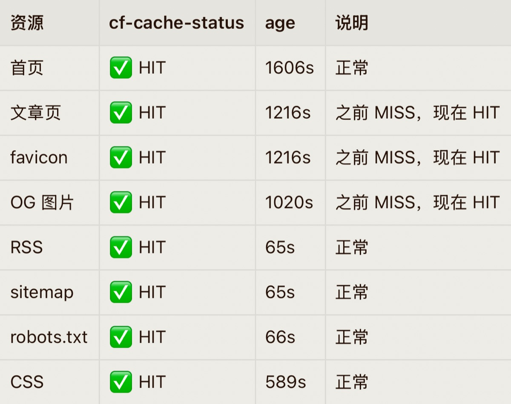
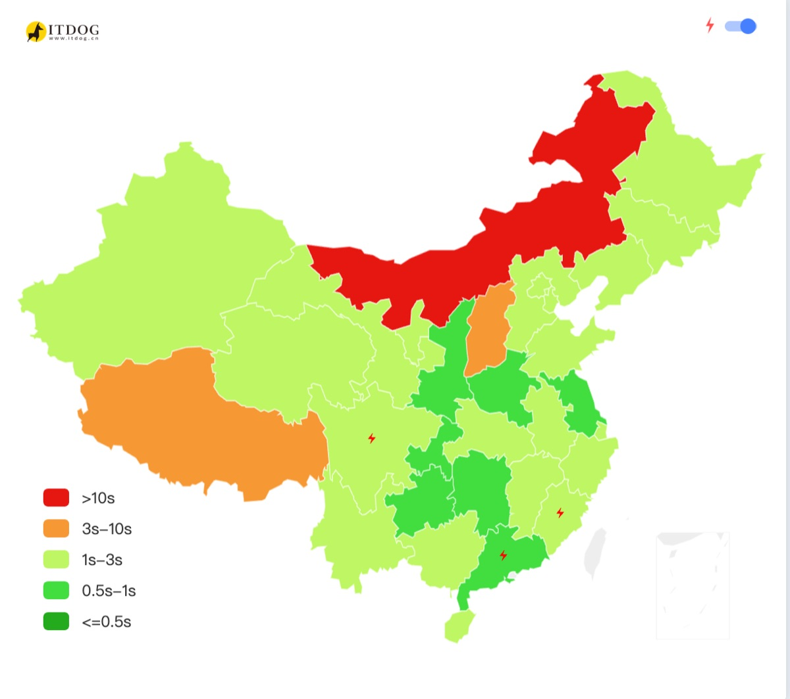
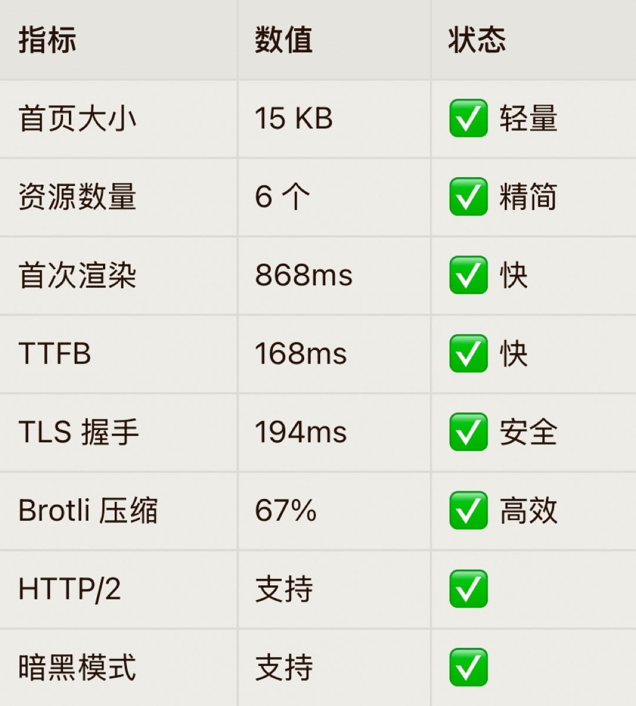

+++
title = '利用 Workbuddy 优化 Cloudflare 边缘加速效果'
slug = '17380'
date = 2026-07-27T08:46:59+08:00
draft = false
tags = ['建站', '折腾']
categories = ['折腾']
summary = '用 Workbuddy 一步步优化 Cloudflare 边缘缓存，解决回源慢的问题，itdog 测速全绿。'
images = ['og-image.jpg']
+++

本站的官方合作伙伴为：GitHub和Cloudflare。前者用于存储本站的代码，后者则用于部署网站。

由于众所周知的原因，cf在国内被叫做减速CDN。但是经过我昨天晚上的优化，本站（托管在cf pages中）在itdog的网站测速中已经可以达到全绿！

几乎是秒开！在这里我要感谢一下腾讯的workbuddy，是它一步一步的指导我如何优化缓存，到最后到现在这样。

本来是找Hermes来分析我的博客SEO来着的，但是结果很不好。我的博客每次访问似乎都是回源，这就导致访问速度很慢，找workbuddy调整了缓存规则，又处理了301重定向的问题。

全程都是我手动一步一步的操作，wb来协助看效果，到最后这是Hermes给我的测试结果。

我用itdog测试了一下，基本上全绿。cf压缩过后生成的页面只有5kb，访客访问不再每次都回源，直接从离访客最近的边缘缓存获取。

虽然cf的线路没有特意为中国大陆用户优化，但因为页面很小，所以不太影响速度。

以后我会继续监测博客的访问速度。

Cloudflare真的是一个非常棒的平台！👍
