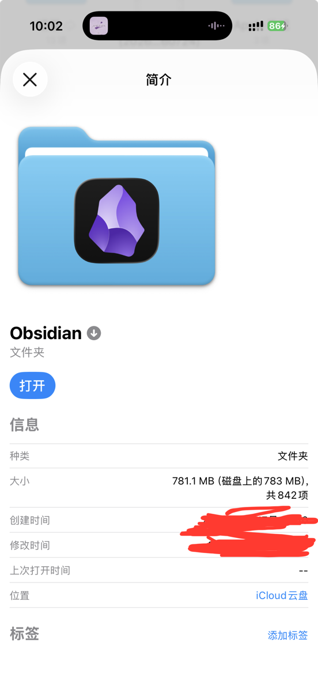

+++
title = '聊聊：我为什么选择Obsidian记录生活'
date = 2026-08-05T10:12:32+08:00
slug = '17891'
tags = []
categories = ['随笔']
draft = false
images = ['p1.jpg']
+++

## 一、前言：告别混乱的生活记录，聊聊我的长期记录心得

我曾经更换过很多笔记软件，也试过很多不同的记录方式。我试过文字，音频，视频，来记录自己的生活。但这些方式都有各自的痛点：备忘录杂乱、相册碎片化、随笔随写随丢、回忆无法串联。

在长期试用后，我想说说最终决定长期坚持Obsidian的原因。

Obsidian不只是笔记软件，更是个人生活的专属记忆库

## 二、为什么普通生活记录，不需要花里胡哨的工具？

我个人认为，普通人的记录生活应该是简单的。

生活记录的核心需求是：轻量化、无压力、可回溯、可自由改写、开放格式、永久留存。

首先就排除社交平台，社交平台记录易被推送淹没，而且泄露隐私（我更喜欢在网上写作的那种神秘感），备忘录无分类逻辑、专业的文档软件又过于正式。

最好的生活记录工具，是适配自己习惯、不束缚、能沉淀自我的工具。

这里我推荐obsidian。
## 三、为什么是Obsidian？

### 1. 永久免费
不和印象笔记这类收费软件一样，obsidian本身所有功能完全免费。没有功能限制。同时，也没有广告，推广，它只是一个安静的笔记软件。

### 2.啥都能记
在ob中你可以储存任何你想要保存的东西。文字、图片、视频、音频、文件等等。不受网络限制，只要你的硬盘够大，什么都能往里存。

### 3.资源管理器般操作逻辑
Obsidian 的文件存储逻辑和系统资源管理器本质一致。你打开硬盘里对应的库文件夹就能看到，所有笔记按照分类存放于各个文件夹，目录结构和软件内展示的完全相同。你在系统文件夹中的操作在ob中是同步的。

### 4.开放格式
Obsidian 使用 .md（Markdown）格式储存笔记。Markdown是一套开放通用的纯文本格式，和txt文件相似，任意电脑都能直接打开阅读。
你可以把文件迁移到其他支持Markdown的笔记软件；文件默认保存在本地，不会自动上传云端，隐私性更强。

需要留意：Obsidian特有的双链、内部链接等功能，更换软件后可能无法正常使用。即便未来Obsidian停止维护，你的全部笔记文件依旧保存在本地硬盘中。

#### 缺陷

这个后面有说，Obsidian不提供自带的云同步服务，你需要自己配置这个功能。

### 5.隐私与安全
Obsidian 默认将整个知识库保存在本地硬盘，不会自动把笔记上传至第三方云端。和许多强制同步数据的笔记软件不同，没有人能未经许可获取你的内容，数据控制权完全掌握在自己手中。但这也意味着你需要定期备份你的笔记库，以防意外丢失。

### 6.功能强大

Obsidian支持安装大量社区插件，可以拓展各式各样的功能，自定义空间很大。
不过对于日常记录来说，软件自带的基础功能就已经足够使用，大部分插件普通人基本用不上，不必盲目安装。

## 四、普通人专属！我的极简生活记录用法

我在[你的博客有多少篇文章？](https://sheep5.net/archives/87)中提过这个问题。

> 写文章这个东西很有趣，一旦开始写，就停不下来了。从一开始写的”长篇大论”，到后来一点小事也会记录下来。

从”无事可写”到”无话不说”。

不必追求完美，也不必追求各种高大上的插件和功能。简单的把它当成一个笔记本用就好。

说说我的博文发布流。

我在 obsidian 里一共有两个文件夹。

- 适合发布的文章
- 不适合发布的文章

平时遇到想要写的东西，不要因为它是私密的就不写。把它们全部放大不适合发布的文章文件夹，在这里你可以记录你想记录的任何事情。

我就在这里记录了很多私事，日记，想记录的照片视频，甚至是音频。我建议你在选择同步方式的时候选一个容量大，不限制文件大小，稳定的储存工具。

先是一股脑把所有想写的东西写下来，然后再分类。

**这里增加一条：可以增加一个叫草稿箱的页面，专门记录头脑中一闪而过的灵感，如果是需要特别记录的可以直接在“适合发布的文章”文件夹中创建好文章标题，第二天找时间再写。**

可以用 AI 帮你整理，筛选。

我的ob文件夹之前就是笔记太多了，想要从中筛选出能发布的笔记太难了。只能用AI来不断筛选，最后人工过目一遍，最后批量导入到博客。

## 五、客观避坑：Obsidian不是万能的，适合这类人使用

这段话我是用AI生成的。

1. 适合人群：想沉淀自我、喜欢记录生活、重视隐私、拒绝碎片化快餐记录的人。

2. 不适合人群：追求一键网红排版、需要社交分享、懒得自主整理的人。

3. 新手忠告：用来生活记录，不求全能，只求坚持。

## 六、关于同步
由于我使用了Apple全家桶所以我使用了[iCloud同步](https://sheep5.net/archives/75)。开通iCloud+会员，我获得了一个几乎用不完而且不限制文件大小的同步盘。

其他安卓用户可以试试其他第三方插件同步。

能折腾的建议使用腾讯云的轻量对象储存同步，选择国内储存桶，速度直接起飞。笔记占用的空间小，流量也小。你可以在里面保存任何大小的文件，即使是大的视频文件也能轻松搞定

不太建议买那个官方的同步服务，太贵了，大文件上传也很慢。

轻量对象储存一个月用不了几块钱，网上有很多教程。

但我感觉Apple用户还是iCloud同步最方便。

嗯，Cloudflare的R2也是个不错的选择。

下面这个是我的ob仓库文件夹大小。

## 七、结语：记录生活，是写给未来自己最温柔的礼物

一款优秀的笔记软件给予我们更多选择权，但不必追求把所有功能用尽。好好记录、妥善保管自己的文字，远比折腾各类拓展功能更有意义。

## 互动环节

1. 提问互动：你平时习惯用什么工具记录生活？

2. 欢迎留言交流记录心得