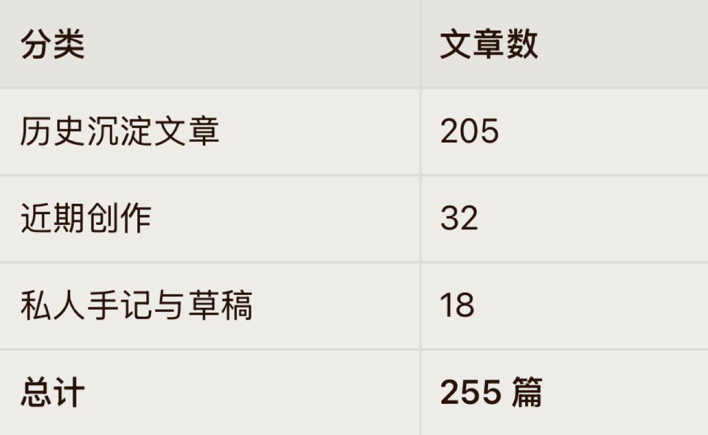
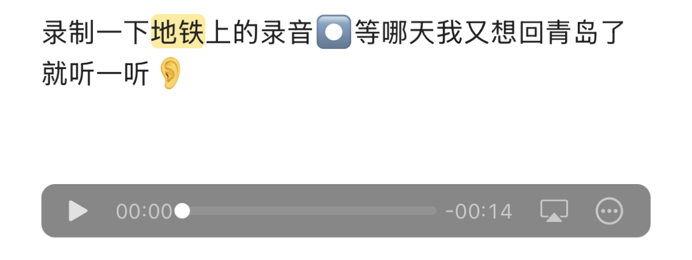

+++
title = '我自认为我是一个感性的人'
date = 2026-08-04T09:01:33+08:00
slug = '19717'
tags = []
categories = ['随笔']
draft = false
images = ['p1.jpg', 'p2.jpg']
+++

昨天晚上在翻以前写的文章，感触很深。

我细细的看完了大部分文章，得到一个结论：原来我以前这么快乐，这么充实。没有我想象的那么无趣。

我会在出门旅游的时候给自己录制当时的音视频，好给自己以后回忆。

我会把生活中遇到的错误记录下来，好让未来的自己避坑。

我会记录生活中遇到的有趣的事。

生活中的酸甜苦辣都被我记录到了obsidian中。

我问Hermes，我有多少篇笔记了，仔细数数原来已经有这么多了。

从年初到现在，整整半年了。

现在看看这些笔记，有些会让我哈哈大笑，也有些会让我感到无地自容。仿佛那个有趣的灵魂又回来了。

原来我的生活不是那么无聊的。每天都有不一样的事情发生。生活中充满了友爱和欢乐。

我甚至还找到了一条当时在青岛地铁上给未来的自己录制下的一条音频。

我强烈建议你也像我一样把每天的生活用文字，照片，视频，音频记录下来。生活是无序的，但文字是。

我总能在以往的文章中找到过去的自己给未来留下的惊喜，每读一遍都有新的收获。

最后，我还是推荐你使用obsidian这款笔记软件。我会单独写一篇文章来介绍它。
