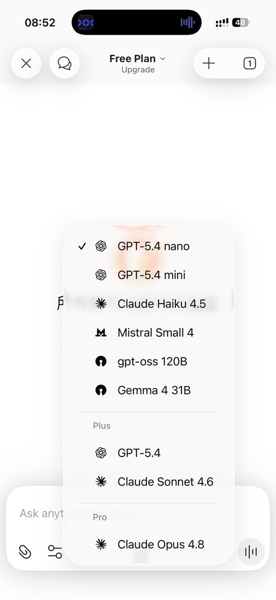

+++

title = '最近在港区用 ChatGPT：没想到会这么稳'
date = '2026-08-07T10:15:01+08:00'
slug = '最近在港区用-chatgpt：没想到会这么稳'
tags = ['ChatGPT']
categories = ['随笔']
draft = false
images = ['img1.jpg', 'img2.jpg']
url = "/archives/214/"
+++

## 前言

众所周知，在港区App store无法下载ChatGPT。到目前为止只能使用grok和Gemini。想要体验ChatGPT只能将地区修改为美国或其他开通ChatGPT的地区。

可我不想换区了，有如下原因。

  * 港区ID是最适合大陆用户的外区，语言相似
  * 支付方式好解决，Alipay HK就能搞定
  * 封号概率小

美区 App Store 操作起来太麻烦了，我又没有合适的付款方式。我了解的情况是，App Store 的支付方式通常会跟银行卡的发卡国家/地区有关，所以切到美区往往需要绑定美国发行的卡。美区 PayPal 我也觉得更麻烦，可能还要完成更复杂的实名认证流程，而且我担心账号因此出现风险。

## 曲线救国

那有没有一种既可以留在港区也可以使用ChatGPT的方法呢？

**答案是：Duck.ai**

### 什么是Duck.ai?

> Duck.ai 是 DuckDuckGo 体系下推出的对话式 AI 使用入口。它的定位不是某一个单一模型，而是把多个大模型的能力汇聚在同一个界面里：你可以在不同任务（问答、写作、内容整理、代码/技术协助等）之间，按需求选择更合适的模型与交互方式，从而获得更贴近目标的输出效果。

> 对个人用户来说，它的实用之处在于“可切换的能力”——同一件事不必死磕在单一模型的风格上；当你觉得某次输出不够理想时，可以用切换模型/模式的方式调整方向，让写作与信息处理更顺畅、也更容易形成稳定的使用习惯。

注：duckduckgo是一个以保护隐私为目标的搜索引擎。duck.ai是其旗下的人工智能服务平台。

简单来说，duck.ai提供了一个平台，一个在港区可用的ChatGPT。

只不过你需要在duck.ai的网站上输入问题罢了。

经我试用，免费版套餐足够日常使用。付费版套餐则无法在港区订阅，不过我觉得大多数人也不需要额外订阅。

免费版能提供的模型如下：

## 特色功能

duck.ai 延续了 duckduckgo 的隐私保护理念：你在平台上提出的内容不会用于人工智能训练，同时平台也不会保存你的聊天记录。

对于热衷于保护隐私的朋友，这个平台值得一试。
