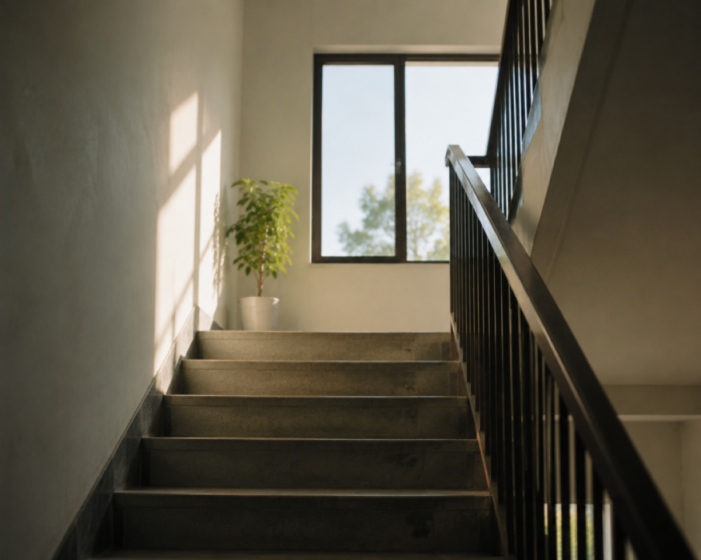

+++

title = '腿伤恢复记录：终于可以正常上楼了'
date = '2026-08-09T08:56:06+08:00'
slug = '腿伤恢复记录：终于可以正常上楼了'
tags = []
categories = ['随笔']
draft = false
images = ['img1.jpg']
url = "/archives/222/"
+++

自从出车祸以后就没上过楼，一直在楼下住着。大约有40多天了。这40多天我过得还好，就是不能动只能在床上，这点很不好。

一开始以为可能以后就这样了，到后来一点一点的恢复好，我对生活的信心也越来越足。

一直到现在，我终于上了楼。5楼很高，但我还是一口气爬了上去。我自己都有点佩服自己，怎么能这么厉害。就好像腿没有受伤一样。

上楼之后，一开始走路还有些不习惯，腿总是不自觉地保持伸直的状态。后来慢慢尝试，一点点调整，身体也逐渐找回了原来的节奏。

现在基本已经恢复正常走路了，只是腿部弯曲的角度还没有完全恢复，动作幅度还不算特别大。不过对于日常生活来说，已经完全够用了。能一步步恢复到现在的状态，也算是一个小小的进步。

医生说完全恢复好需要3个月，希望我能早点康复。
