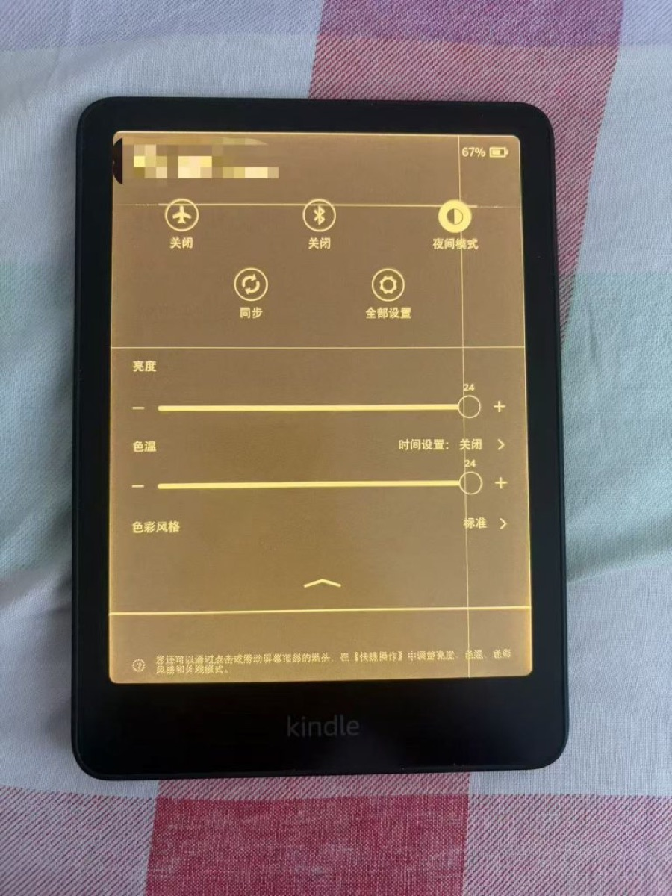
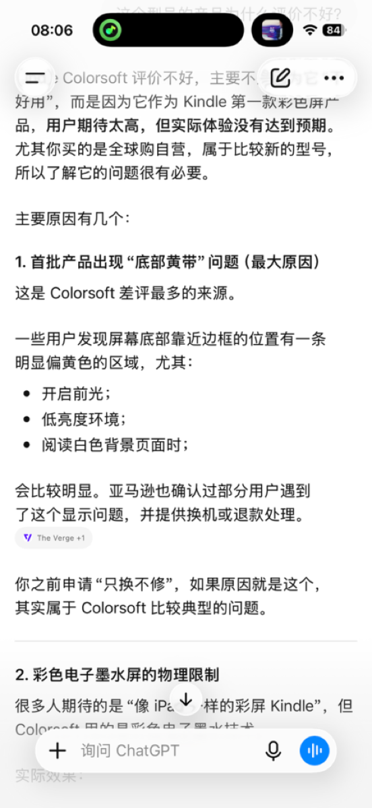

+++

title = 'Kindle Colorsoft 出现屏幕问题，我申请了京东换新'
date = '2026-08-10T08:11:36+08:00'
slug = '刚买一个月的-kindle-坏了：记录一次意外的换货经历'
tags = ['kindle']
categories = ['随笔']
draft = false
images = ['img1.jpg', 'img2.jpg']
url = "/archives/250/"
+++

悲剧了。就在昨天，[刚买一个月的kindle](https://sheep5.net/archives/108)屏幕出现故障了。

昨天下午看完东野圭吾的书以后偶然发现kindle屏幕上似乎有两道线。我以为可能是屏幕残影的原因，就刷新了几次，最后重启。

没想到没用，两道线还是在那里。（这张图是我后来把暖光和亮度调到最大拍摄的，可以明显的看到横竖两条线）

不好的预感袭来，赶紧去京东找客服问一下。客服先是让我重启试试，我说已经重启过了没用。就让我找只换不修那里申请换新。

我的kindle是在京东自营全球购上买的，当时买的时候还有一个“365天只换不修”服务。现在才过了不到一个月就坏了。

我只能申请换新试试，简单的填写完信息就等着审核就好。昨天下午申请的，现在还在等服务中心接单。

看了京东的差评和小红书的吐槽，我不禁有点慌。有人说明明不是自己的问题，但是京东就是以这个原因拒绝换新。还有各种维权帖子。

其实我是在昨天查了chatgpt才正式确认这个产品在海外有一些问题，例如屏幕下方会发黄之类的。但亚马逊官方提供换货或者退款。

不明白京东为什么要进一个有问题的产品，还是京东的这批货是没问题的？

现在就等着京东的回复了，希望可以正常换新就好。

**更新：**

**京东已经初步同意了我的请求，快递已经发走寄到维修中心。**
