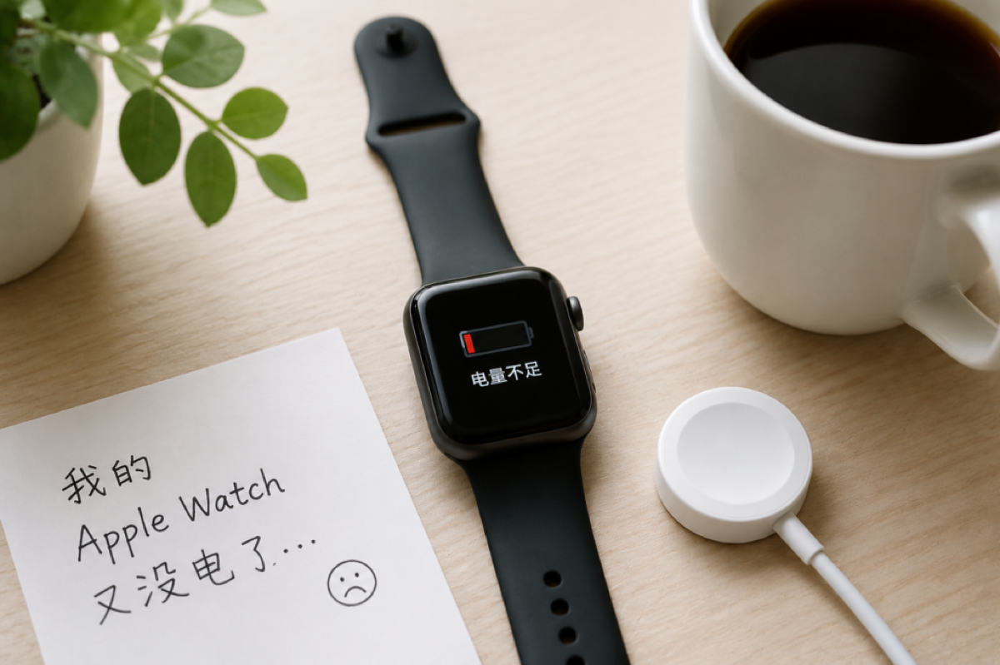

+++

title = '我的 Apple Watch又没电了'
date = '2026-08-11T09:27:42+08:00'
slug = '我的-apple-watch又没电了'
tags = ['Apple']
categories = ['随笔']
draft = false
images = ['img1.jpg']
url = "/archives/269/"
+++

AI生图，仅供参考。

## 又一次发现 Apple Watch 没电

就在刚刚，我的Apple Watch又没电了。这已经是我不知道第多少次发出这样的感叹了。

其实iwatch的续航已经很强了，正常用大约能用两天。但我总是忘记给它充电，可能两天过得太快了。

## 一、Apple Watch 带来的便利，让我习惯了它的存在

iwatch买回来带给我了不少便利。比如它可以提醒消息，检查心率，记录运动，支付，回微信等等。

记得有一次和家里人吵架，Apple Watch 甚至记录下了我情绪激动时心率升高的变化。

## 二、但它也增加了一件需要操心的事情

没错，和很多智能手环相比，Apple Watch 的续航确实短了不少，通常只能坚持一两天。如果使用频繁一些，甚至可能撑不到两天。这也意味着，除了每天关注手机的电量之外，我还多了一件需要留意的事情——Apple Watch 的电量。

有一段时间，我甚至觉得自己像是在伺候一位“大爷”一样伺候着 Apple Watch。每天不仅要关注手机电量，还得操心它什么时候该充电，生怕它哪天突然罢工。

## 三、除了没电，我的手腕也留下了它的痕迹

长时间佩戴这种智能设备，难免手上会留下印子。这是让人最崩溃的，戴着紧了，夏天容易出汗，皮肤就容易泛红。

面对手腕上的这些痕迹，我也只能做一些调整，比如减少佩戴时间，让手腕有机会恢复，尽量避免留下太明显的印子。

## 结尾：我可能还是会继续戴下去

虽然戴iwatch有不少问题，但我还是愿意在睡觉的时候戴一下，看看睡眠质量。虽然这个功能从我买回来到现在也没用过几次。

以后还是要关注一下自己的睡眠质量了。
