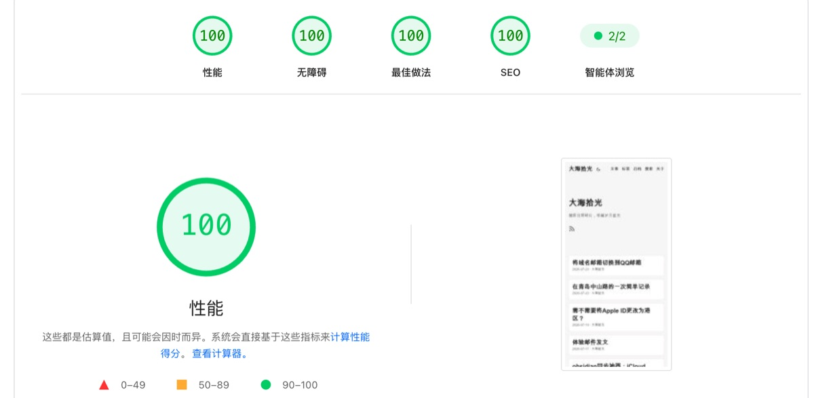

+++
title = '将博客更换为静态博客'
slug = '26972'
date = 2026-07-21T17:51:35+08:00
draft = false
tags = ['建站']
categories = ['折腾']
summary = '从 Wordpress 到 Hugo，省下服务器费用，还能拿到 PageSpeed 100 分。'
images = ['og-image.jpg']
+++

今天把博客改成静态博客了，用的是hugo。之前博客一直放在Wordpress，.org和.com都试过，但是最后都放弃了。Wordpress的问题太多了，不仅需要一台独立的服务器，而且用起来麻烦，服务器每年还要续一笔不小的费用。

最后还是决定用hugo了。hugo轻量，安全，速度快，在免费的edgeone就能跑，每年只需要付一个域名钱。虽然不能手机码字了，但是和obsidian配合起来也是挺方便的。在pagespeed上分数也能拿到100分。

目前来看，博客就先这样吧，能省就省。
