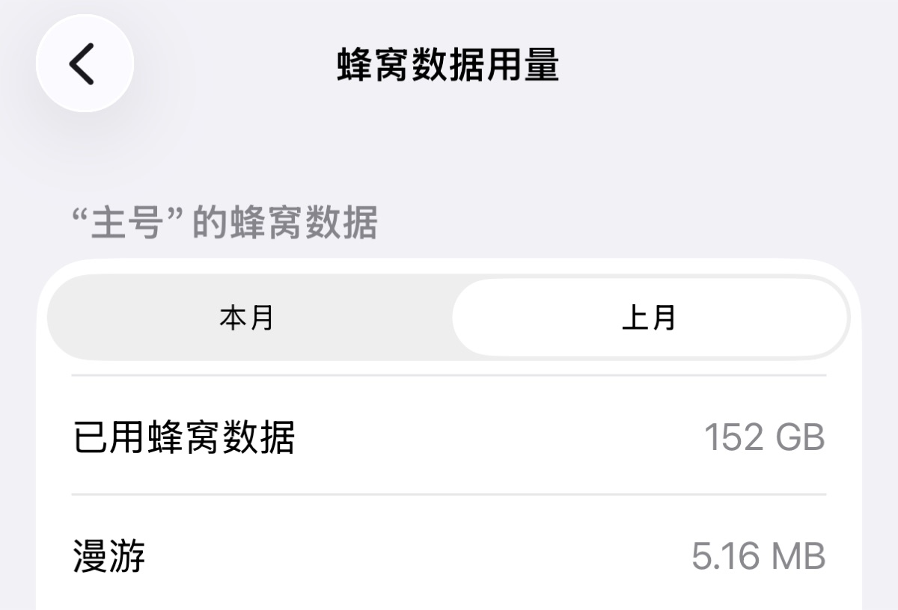

+++
title = '月初看账单，我被自己的流量吓到了'
date = 2026-08-01T07:28:05+08:00
slug = '27217'
tags = ['流量', '账单', '消费']
categories = ['生活']
draft = false
images = ['og-image.jpg']
+++

今天是八月一号，我翻了翻[上个月的移动账单](https://sheep5.net/posts/42197/)。发现不仅流量用了100多个G，账单也突破了我的使用极限😱

我赶紧打开手机设置复盘一下流量到底花在哪里。想了一下，大概有以下方面。

## 个人热点

这是大头，大约有50G。上个月我在电脑上消耗了大量的流量。其实仔细想一想好像也没做什么，为数不多的可能是整理了obsidian上的笔记吧。

我上个月把 Obsidian 里那 200 多篇笔记，用 AI 反反复复整理了好多遍。🤣 笔记仓库也就 500MB 出头，我让 workbuddy 跑了好几轮内容分析，再用 [Syncthing 同步到服务器](https://sheep5.net/posts/15687/)。最后为了上线这个[ Hugo 博客](https://sheep5.net/posts/26972/)，筛了一遍，把能发的文章导进了 Hugo。

[折腾Hermes](https://sheep5.net/posts/38879/)和workbuddy也费了一些流量。

其他的，可能是下载了不少软件，从zb下载电子书，听音乐之类的。这个应该算小部分。

## 即时通讯

像微信之类的App大约用了8G多，因为这个是必须保留的，没什么可说的。

## 娱乐软件

小红书，知乎，抖音之类的软件也用了不少。这些软件都是碎片化时间看的，无聊的时候就看一看。也蛮好。音乐软件是Apple Music和汽水音乐换着听，这样不会无聊。🎵

## 系统服务

这个月可不能乱升级系统了，之前有WiFi的时候习惯了，系统升级随手就点上了，iCloud备份也不能用。

## 总结

总的来说，我一个月流量一共就60GB。看着挺多，但因为我现在没有WiFi，不节约点很快就会用完。上个月流量包也买了不少😭真是痛心💔
