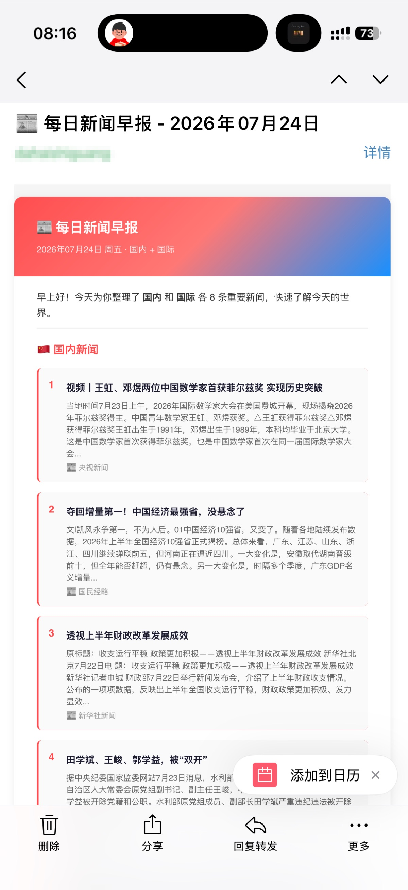

昨天我开通了小米的 MIMO token plan。第一次用这个东西所以我只开通了 Lite 版本。在腾讯云和小米之间我选了小米，主要是后者的量更大一点，更耐用。

开通这个东西主要是为了使用 Hermes，一个小龙虾助手。我恰巧有一台闲置的轻量应用服务器，闲着也是闲着，所以干脆就安装了小龙虾。

配置好模型和通道以后我就开始探索这个东西到底有什么用。在网上搜索了一下发现了很多有用的 skill。我安装了 QQ agent 邮箱，notion，腾讯新闻，腾讯天气等等。

我最先开始做的是邮件提醒，就是每天早上定时给我推送以下内容：

- 腾讯新闻的今日要闻
- 今日天气
- 昨日博客访问量情况
- blogclubs 中我可能感兴趣的文章
- 各大平台热搜
- ……

QQ agent 邮箱目前正在内测，一个邮箱一天能发 50 封邮件，对我来说足够了。

这种自动化的方式给我节省了很多时间，大大提高了我的效率。

最终实现效果可以参考下图。

