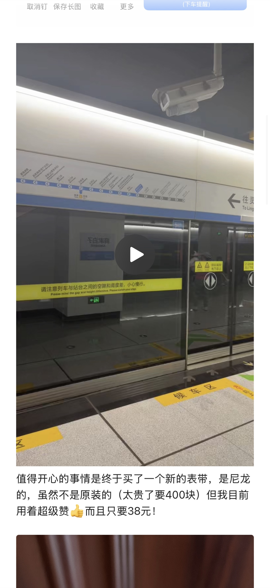

+++

title = '我存了一整条青岛地铁，就等今天用'
date = 2026-08-01T08:08:38+08:00
slug = '41802'
tags = ['青岛', '地铁', '随笔']
categories = ['随笔']
draft = false
images = ['og-image.jpg']
url = "/archives/37/"
+++

最近生病在家修养，哪里也去不了。

无聊的时候翻了翻以前写的文章，无意中找到一篇只有日期没有标题的文章。打开一看，原来是当年去青岛玩的时候录下的青岛地铁音频，视频，图片。

本来当时想着的是，未来有一天，自己如果还想坐一次青岛地铁就打开这个文件听听里面的声音，就当做再坐一次了。

没想到这一天来的这么快。不是不想去，而是去不了。

按照医生的说法，我不能随便下床，只能在家修养。点开那个视频，当时的场景又历历在目，仿佛就像发生在刚刚一样。😭看着当时那个健康又认真记录的自己，我心里五味杂陈。

当年存的东西，没想到是一笔巨大的精神财富。没想到我今天会这样用到它。

人是乐观的动物，总以为未来会一帆风顺，没有挫折。但可惜的是，人生中不如意的事太多了，不一定什么时候就会遇到意外。我曾以为我这么年轻，应该不会遇到什么意外。

没想到几个月后就遇到了车祸。

还好，不严重。但膝盖也受伤了😢。

只能先这样了。😭
