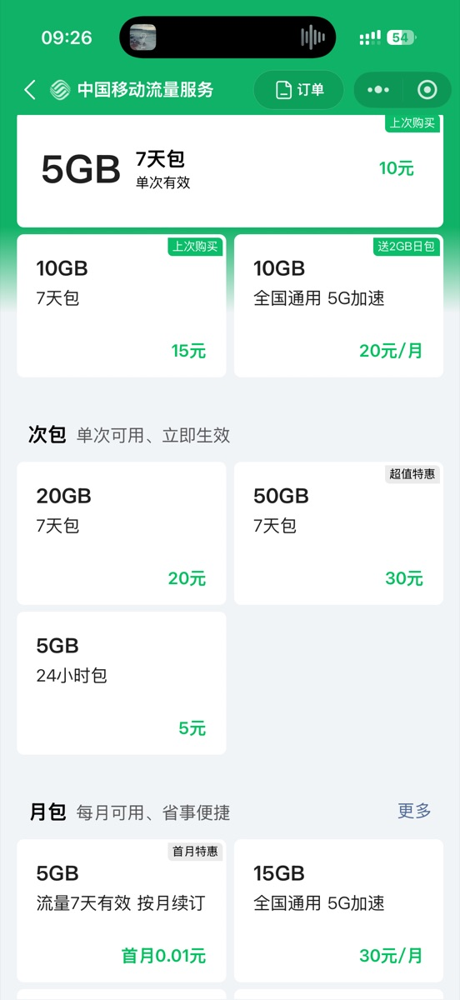

+++

title = '最近流量用的太多了'
slug = '42197'
date = 2026-07-24T09:36:50+08:00
draft = false
tags = ['随想']
categories = ['日常']
summary = '月底没到流量先见底了，这个月竟然用了100多G。'
images = ['og-image.jpg']
description = "今天是24号了，月底还没到，我的流量先见底了。因为一些原因，我现在没有WiFi可以连，只能先用着流量。我的手机套餐本来是有60GB的流量，月初想的是这么多流量怎么用应该都够用了，所以，短剧，短视频，音乐，热点，我都用了个遍。"
url = "/archives/40/"
+++

今天是24号了，月底还没到，我的流量先见底了。因为一些原因，我现在没有WiFi可以连，只能先用着流量。

我的手机套餐本来是有60GB的流量，月初想的是这么多流量怎么用应该都够用了，所以，短剧，短视频，音乐，热点，我都用了个遍。

但是没想到还没到15号，流量就告急了。没想到会用的这么快，可能是平时WiFi用着习惯了吧。

没办法只能在微信里充值流量包，说实话移动的流量包有点贵，而且有一些还是第二个月自动续订的，还要自己在中国移动App里取消订阅。

流量充了不少，我一看账单。这个月竟然用了100多G流量。

目前套餐里仅剩不到5G流量了，距离下个月还有几天，能省就省吧。😀
