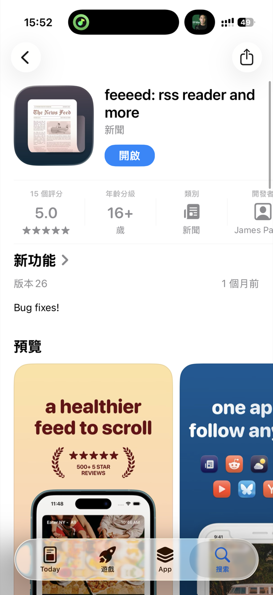
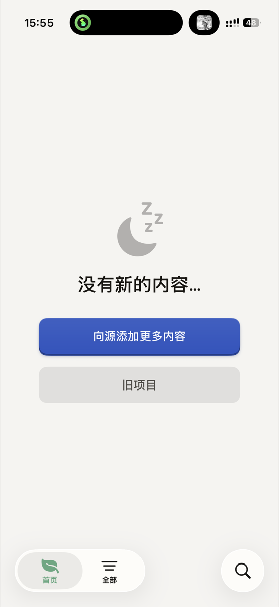
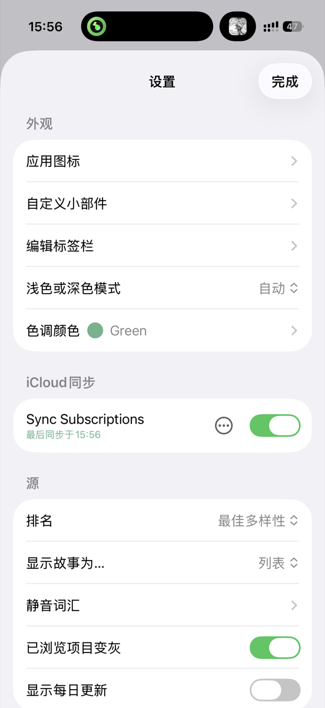

+++
title = '终于找到适配iOS、顺手的RSS阅读器'
date = 2026-08-05T16:05:04+08:00
slug = '83357'
tags = []
categories = ['折腾']
draft = false
images = ['p1.jpg', 'p2.jpg', 'p3.jpg']
+++

之前的RSS订阅器一直用的是QI Reader。这款RSS订阅器可以在safari浏览器中打包成应用放在桌面上。但可惜的是，这个不起眼的app一直被我忽略，放在角落吃灰了。

加上最近把主力浏览器换成Chrome了，所以，是时候该换一个了。

在网上搜索了一会儿，在对比了很多阅读器后，我选择了这款软件。

**Feeeed**

先说第一印象：App图标看着平平无奇，第一眼甚至会觉得是小众粗制工具，实际上手之后反差感很强。

港区App Store里支持简体中文的原生RSS阅读器选择并不多，要么价格不友好，要么功能残缺。而Feeeed刚好踩中我全部刚需：

• 核心功能完全免费，没有强制弹窗广告

• 原生支持iCloud订阅源同步，iPhone多设备无缝切换

• 内置简体中文，上手没有语言障碍

• 基础阅读管理功能齐全，满足日常资讯订阅需求

简单调整几项偏好设置，导入订阅源，立刻就能投入使用。