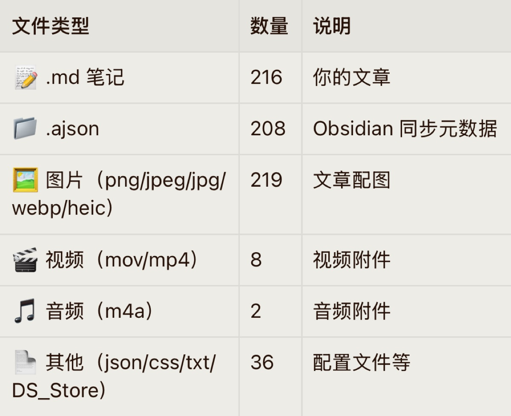

好奇那些已经写了 10 多年文章的老博主，他们这么多年累计写了多少文章。

我问了我的 Hermes，它告诉我我已经写了 216 篇文章了。

一开始看 ob 我有 400 多个文件还以为写了 400 篇。因为还有一些文章已经找不到了，所以实际的文章数应该比这个多。

嗯，不对。还有一些是我收藏的文章。加加减减大概是 220 篇文章吧。

写文章这个东西很有趣，一旦开始写，就停不下来了。从一开始写的"长篇大论"，到后来一点小事也会记录下来。

从"无事可写"到"无话不说"。说说我的博文发布流。

我在 obsidian 里一共有两个文件夹。

- 适合发布的文章
- 不适合发布的文章

平时遇到想要写的东西，不要因为它是私密的就不写。把它们全部放大不适合发布的文章文件夹，在这里你可以记录你想记录的任何事情。

我就在这里记录了很多私事，日记，想记录的照片视频，甚至是音频。

先是一股脑把所有想写的东西写下来，然后再分类。

可以用 AI 帮你整理，筛选。

慢慢的把适合发表的文章这个文件夹填满，然后发布到 hugo 博客上。

我在 workbuddy 设置了一个流程。大概如下⬇️

1. 发布文章指令
2. AI 自动从我 ob 的"适合发表的文章"文件夹找最近更新的文章
3. 扫描内容
4. 开启资源文件夹功能
5. 自动添加标签，处理标题，自动压缩图片
6. 处理成可以发布的文章格式
7. 推送到 GitHub
8. Cloudflare pages 自动部署

一分钟左右，博客的文章就能在首页看到了。😁🚀🚀🚀

[obsidian](https://sheep5.net/posts/23689/) 就是我博客的编辑器同时也是我的笔记软件，两者合一，非常高效，因为有 [iCloud 同步](https://sheep5.net/posts/66593/) 所以也成本极低。

以上就是我的文章发布方式，希望能对你有所帮助！😉
