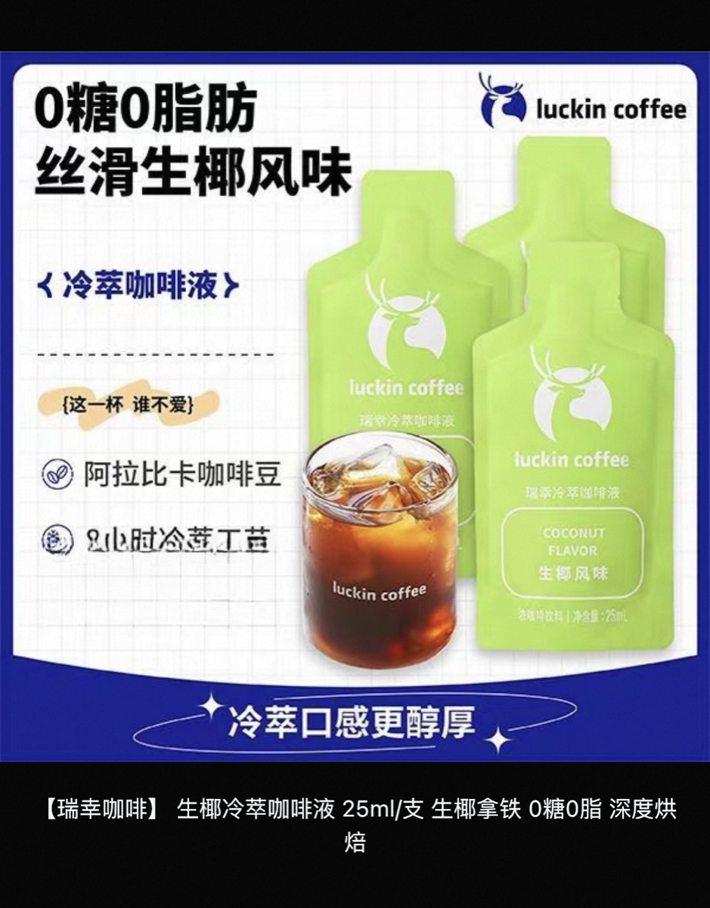

+++
title = '今天尝试了瑞幸生椰冷萃咖啡液'
date = 2026-07-27T15:01:25+08:00
slug = '89540'
tags = []
categories = ['随笔']
draft = false
images = ['p1.jpg']
+++

今天早上打算在淘宝闪购上买咖啡。忽然发现了一家之前没有见过的新店，叫淘宝便利店。可能是因为新店，所以东西还挺便宜。

搜索了一下有卖雀巢速溶咖啡的，又发现了瑞幸生椰冷萃咖啡液的。我对生椰拿铁很有好感，很喜欢喝。所以顺手买了一包尝尝。

经过了漫长的等待......

终于在大约1小时以后收到了货。赶紧试试。打开包装，发下里面是浓缩的咖啡液，有点厚，放在水里搅拌一下就可以了。

尝了一下，感觉不是生椰拿铁的味道。是生椰美式，不太习惯这个味道，我还是喜欢带甜的咖啡。

感觉被坑了，上次买的也是冷萃咖啡液，不过是美式的，都比这个好喝。😅

以后不买了。😤

大约就是这个东西，以后一定避雷。